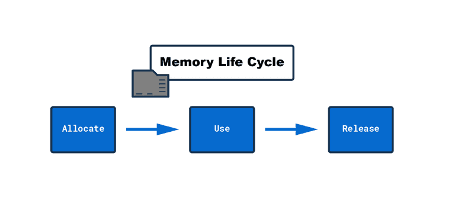

# This Memory Life Cycle

## Allocate memory

- JavaScript takes care of this for us: It allocates the memory that we will need for the variables and objects we created in our code.

## Use memory

- Using memory is something we do explicitly in our code: Reading and writing to memory is nothing else than reading or writing from or to a variable or object.

## Release memory

- This step is handled as well by the JavaScript engine. Once the allocated memory is released, it can be used for a new purpose.

## Important Note:

- The call stack and heap work together to manage the executions of our JavaScript code
- The call stack calls a function from the memory heap and after executing it removes it from the stack if unused.
- The removal of unused objects and functions in memory heap are managed by the Garbage Collector
