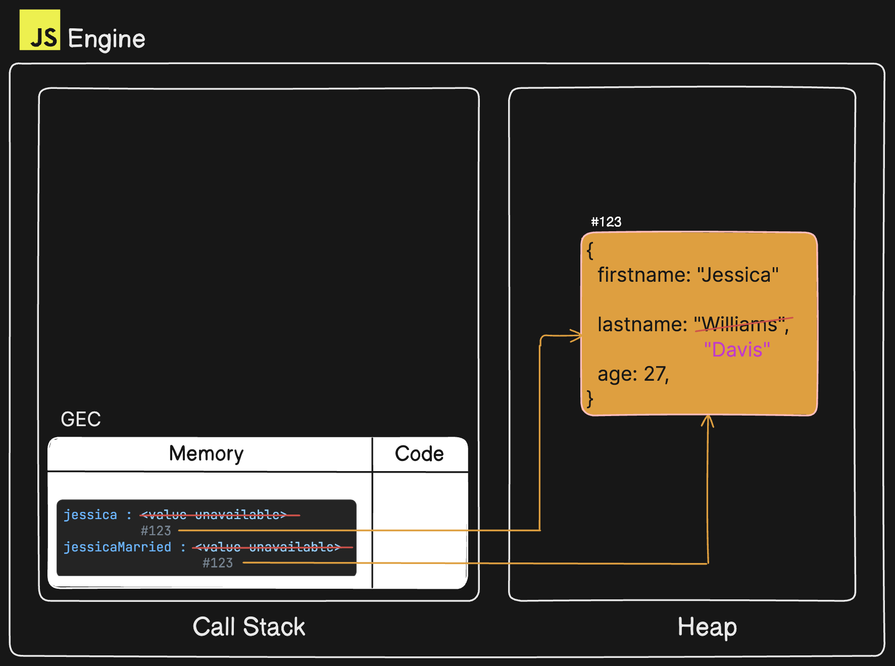
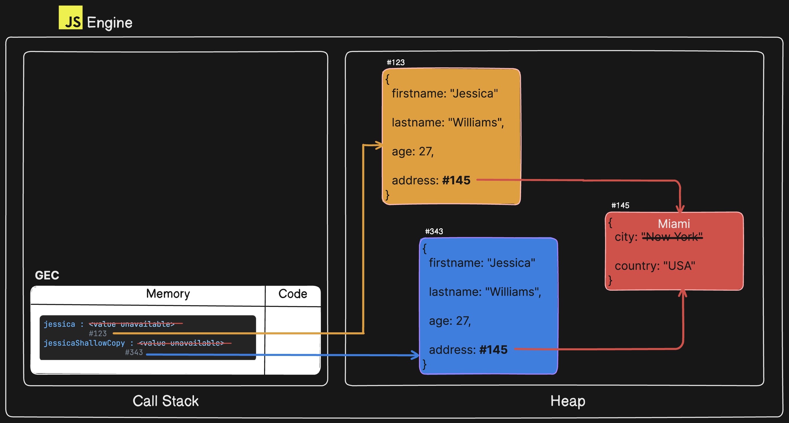
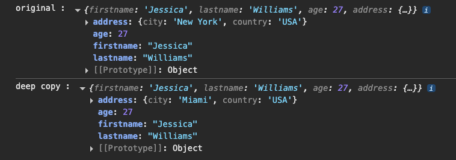
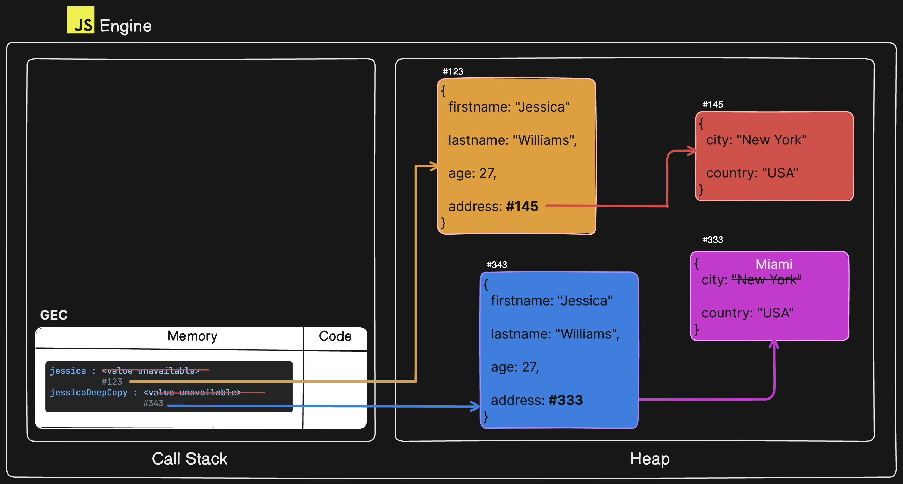

# Object References In Practice

**`Example : 1`**

```javascript
"use strict";

// creating an object
const jessica = {
  firstname: "Jessica",
  lastname: "Williams",
  age: 27,
};

// jessicaMarried pointing to same object in memory as jessica
const jessicaMarried = jessica;
jessicaMarried.lastname = "Davis";

console.log("Before:", jessica);
console.log("After:", jessicaMarried);
```

**OUTPUT:**

`Before: {firstname: 'Jessica', lastname: 'Davis', age: 27}`

`After: {firstname: 'Jessica', lastname: 'Davis', age: 27}`

**EXPLANATION:**

**`jessica`** is a variable pointing to an object in heap memory, and **`jessicaMarried = jessica`** means that **`jessicaMarried`** is now **pointing to the same object in heap memory as jessica object.** Therefore, when we do **`jessicaMarried.lastname = "Davis";`** now the object's **`lastname`** property is **`"Davis"`** and since both variables; **`jessica`** and **`jessicaMarried`** are **pointing to the same object in memory their outputs are same.**

Please see below for a visual representation.

## How it all works in memory



**`Example : 2`**

```javascript
"use strict";

const jessica = {
  firstname: "Jessica",
  lastname: "Williams",
  age: 27,
  address: {
    city: "New York",
    country: "USA",
  },
};

// shallow copy
const jessicaShallowCopy = { ...jessica };
jessicaShallowCopy.address.city = "Miami";

console.log("original :", jessica);
console.log("shallow copy :", jessicaShallowCopy);
```

**OUTPUT:**


**EXPLANATION:**

In this example we have variable **`jessica`** pointing to an object in heap memory, and our intention is to copy the object that the variable **`jessica`** is pointing to. Hence we have made use of the spread operator (...):

- **`const jessicaShallowCopy = { ...jessica };`**

which simply copies all properties into a new object and its reference is assigned to the variable named **`jessicaShallowCopy`**.

And now, we have updated the **`city`** property for the **`jessicaShallowCopy`** by doing:

- **`jessicaShallowCopy.address.city = "Miami";`**

But, we noticed that even though a new object in heap memory was created using the spread operator, it somehow still impacted the **`jessica`** object. Why did this happen?

This is because when using the spread operator, all the properties of an object were copied into the new object created. But please observe that the **`address`** is also an an object, which means variable **`address`** is pointing to another object in memory, and while copying **`jessica`** object we it also copies the **reference of the object that the `address` variable is pointing to in memory**, and therefore when one is updated the other object is also affected. This is also known as **`shallow copy`**.

Please see below for a visual representation.

## How it all works in memory



**`Example : 3`**

```javascript
"use strict";

const jessica = {
  firstname: "Jessica",
  lastname: "Williams",
  age: 27,
  address: {
    city: "New York",
    country: "USA",
  },
};

// deep copy
const jessicaDeepCopy = structuredClone(jessica);
jessicaDeepCopy.address.city = "Miami";

console.log("original :", jessica);
console.log("deep copy :", jessicaDeepCopy);
```

**OUTPUT:**



**EXPLANATION:**

In order to get a complete clone of the jessica object where **`jessica`** and **`jessicaDeepCopy`** are pointing to completely seperate memory location and all nested objects are also pointing to seperate memory locations we must use **`strcturedClone()`** method where we pass the **object we want to clone as the argument.**

**For Example:**

- **`const jessicaDeepCopy = structuredClone(jessica);`**

We can clearly see when updating the **`city`** property for **`jessicaDeepCopy`** the **`jessica`** object is intact and unaffected. This is called **`deep copy.`**

Please see below for a visual representation.

## How it all works in memory


