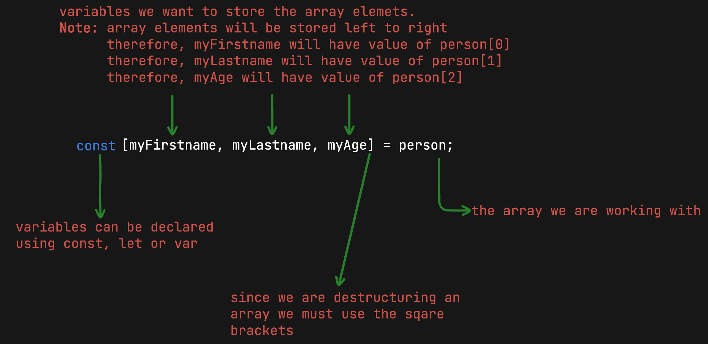

# Array Destructuring

**`Array destructuring`** in JavaScript allows us to **`unpack/extract`** array elements and store them in variables.

Typically, if we wanted to store arrays elements into variables we would do the following:

```javascript
"use strict";

const person = ["Vishal", "Mirchandani", 34];

// extracting array elements using their indexes and storing them into variables
const firstname = person[0];
const lastname = person[1];
const age = person[2];

console.log("firstname:", firstname);
console.log("lastname:", lastname);
console.log("age:", age);
```

**OUTPUT:**

```
firstname: Vishal
lastname: Mirchandani
age: 34
```

**NOTE:** _Please do notice that the above task took us 3 lines. It took us a line for every element in the array to be stored into a variable. With array destructuring the same can be achieved but with a single line of code._

**For Example:**

```javascript
"use strict";

const person = ["Vishal", "Mirchandani", 34];

// array destructuring
const [myFirstname, myLastname, myAge] = person;

console.log("myFirstname:", myFirstname);
console.log("myLastname:", myLastname);
console.log("myAge:", myAge);
```

**OUTPUT:**

```
myFirstname: Vishal
myLastname: Mirchandani
myAge: 34
```

**NOTE:** _Array destructing does NOT manipulate the actual array. The array stays intact._

But what if we don't want all array elements extracted but only a selected few? is that possible? The answer is yes, absolutely! Lets have a look.

**For Example:**

```javascript
"use strict";

const restaurant = {
  name: "Classico Italiano",
  location: "Via Angelo Tavanti 23, Firenze, Italy",
  categories: ["Italian", "Pizzeria", "Vegetarian", "Organic"],
  starterMenu: ["Focaccia", "Bruschetta", "Garlic Bread", "Caprese Salad"],
  mainMenu: ["Pizza", "Pasta", "Risotto"],
};

// only extracting the first 2 array elements from categories arr
const [firstCategory, secondCategory] = restaurant.categories;
console.log("firstCategory:", firstCategory);
console.log("secondCategory:", secondCategory);
```

**OUTPUT:**

```
firstCategory: Italian
secondCategory: Pizzeria
```

We can also skip elements that we do not want to extract by using trailing commas.

**For Example:** only extracting the first and third items from ctegories array

```javascript
"use strict";

const restaurant = {
  name: "Classico Italiano",
  location: "Via Angelo Tavanti 23, Firenze, Italy",
  categories: ["Italian", "Pizzeria", "Vegetarian", "Organic"],
  starterMenu: ["Focaccia", "Bruschetta", "Garlic Bread", "Caprese Salad"],
  mainMenu: ["Pizza", "Pasta", "Risotto"],
};

// only extracting the first and third array elements from categories arr
const [firstCategory, , thirdCategory] = restaurant.categories;
console.log("firstCategory:", firstCategory);
console.log("thirdCategory:", thirdCategory);
```

**OUTPUT:**

```
firstCategory: Italian
thirdCategory: Vegetarian
```

## Array Destructuring Syntax



## Destructuring Nested Arrays

Destructuring of **`nested arrays`** work excalty the same way. must simply specify the syntax of **`nested destructing`** correctly.

**For Example:**

```javascript
"use strict";

// destructuring nested arrays
const nums = [2, 4, [5, 6]];

// extract 2, skip/ignore 4, [extract 5, extract 6]] -> nested destructuring
const [two, , [five, six]] = nums;
console.log("two:", two);
console.log("five:", five);
console.log("six:", six);
```

**OUTPUT:**

```
two: 2
five: 5
six: 6
```

## Default Values In Array Destructuring

Very often in production ready code, we are sometimes unaware of the length of the array and we might end up destruturing it with an additional variable.

**For Example:**

```javascript
"use strict";

const animal = ["Kangaroo", "Mammal"];

// default values in destructing
const [animalName, type, origin] = animal;
console.log("animalName:", animalName);
console.log("type:", type);
console.log("origin:", origin);
```

In the above example we can expect that **`animalName = Kangaroo`** and **`type = Mammal`** but since we added variable **`origin`** also what would it contain? we have already exhausted the **`animal`** array. Well it would simply contain the value of **`undefined`**.

**OUTPUT:**

```
animalName: Kangaroo
type: Mammal
origin: undefined
```

This is where default values can be introduced, we can explicity set default values if the element doesn't exist in the array.

**For Example:**

```javascript
"use strict";

const animal = ["Kangaroo", "Mammal"];

// default values in destructing
const [animalName, type = "Species", origin = "Australia"] = animal;
console.log("animalName:", animalName);
console.log("type:", type);
console.log("origin:", origin);
```

As we can see, while destructuring we have set the default value **`type = "Species"`** and **`origin = "Australia"`**. However, the value of **`type`** does not change as the corresponding array index is present as **`"Mammal"`** but **`origin`** does become **`Australia`** because a third element is not present in the animal array and hence it **`uses the specified default value during destructuring`**.
