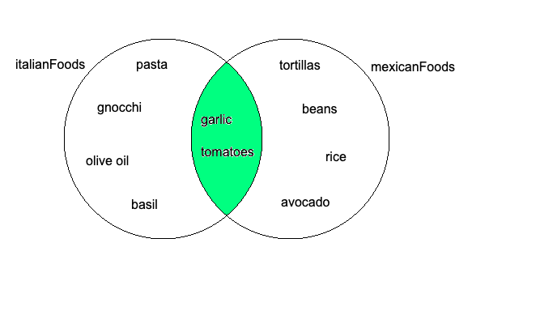
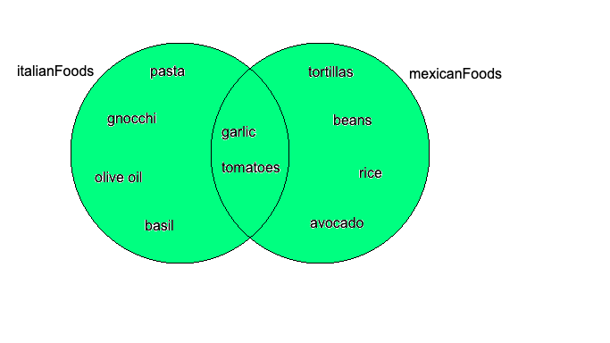
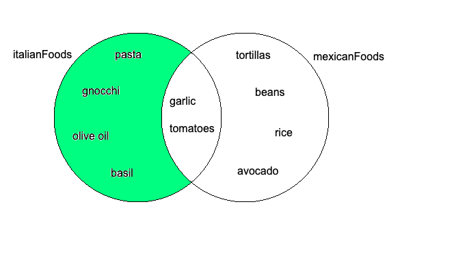
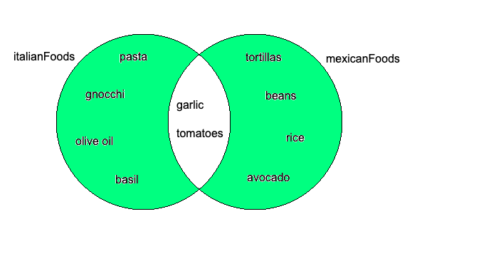
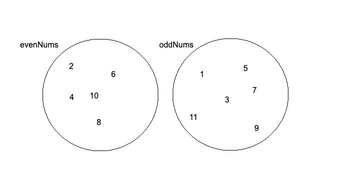

# Sets

A **`Set`** in JavaScript is a iterable data structure
that is a bit like an array but it allows you to store a collection of unique values only.

## Creating a Set

We can create a Set in two ways:

1. **const mySet = new Set();**
2. **const mySet = new Set(<span style="color: orange">iterable</span>);**

We can choose topassing an iterable in order to create a **`set`**. If we do not pass an iterable then we create an **empty** **`set`** and if we do pass an iterable then we create a set with a sequence of values of the specified iterable **`without duplicating any elements`** (meaning only unique elements).

<span style="color: red; background-color: yellow"><strong>NOTE: Set() can only be constructed with the new keyword. Attempting to call it without new throws a TypeError.</strong></span>

**`For Example: `**

```javascript
"use strict";

// creating a set without passing any iterable
const mySet = new Set();
console.log("mySet:", mySet);

// array
const nums = [2, 3, 94, 45, 2, 10, 3];

// creating a set by passing an iterable
const numSet = new Set(nums);
console.log("numSet:", numSet);
```

**OUTPUT:**

```
mySet: Set(0) {}
numSet: Set(5) { 2, 3, 94, 45, 10 }
```

Please notice that **`numSet`** **do not contains any duplicate** values even through the value **`2`** and **`3`** appeared more than once in the array.

**Another Example:**
keep in mind that **`Strings`** are also iterables so we could also create a **`set`** using a **`string`**.

```javascript
"use strict";

// creating a set by passing a string
const mySet = new Set("Anna");
console.log("mySet:", mySet);
```

**OUTPUT:**

```
mySet: Set(3) { 'A', 'n', 'a' }
```

Notice here that **`A`** and a are not considered same therefore **`A`**, **`n`** and **`a`** are all unique letters.

But how can we add our own values to the set?

## Adding values to a Set

We can use the **`add()`** function to add elements to our **`set`**.

**For Example:**

```javascript
"use strict";

// creating a set without passing any iterable
const mySet = new Set();
console.log("mySet:", mySet);

// adding elements to mySet
mySet.add(1);
mySet.add(2);
mySet.add(3);
mySet.add(3);
mySet.add("four");
mySet.add("four");

console.log("mySet:", mySet);
```

In the above piece of code we see that **`3`** and **`four`** has been added twice to the **`set`**. But remember a **`set`** contains only **unique value**!

**OUTPUT:**

```
mySet: Set(4) { 1, 2, 3, 'four' }
```

## Checking size of a Set

We can use the **`size`** property in a **`set`** to check how many items it has.

**For Example:**

```javascript
"use strict";

// creating a set without passing any iterable
const mySet = new Set();

// adding elements to mySet
mySet.add(1);
mySet.add(2);
mySet.add(3);
mySet.add(3);
mySet.add("four");
mySet.add("four");

console.log("mySet:", mySet);

// array
const nums = [2, 3, 94, 45, 2, 10, 3];

// creating a set by passing an iterable
const numSet = new Set(nums);

console.log("numSet:", numSet);

// checking size of sets
console.log("mySet size =", mySet.size);
console.log("numSet size =", numSet.size);
```

**OUTPUT:**

```
mySet: Set(4) { 1, 2, 3, 'four' }
numSet: Set(5) { 2, 3, 94, 45, 10 }
mySet size = 4
numSet size = 5
```

## Check for a specified element in a Set

You can use the **`has()`** method to check if a **`set`** has a specific value/element.

**`For Example:`**

```javascript
"use strict";

// creating a set without passing any iterable
const mySet = new Set();

// adding elements to mySet
mySet.add(1);
mySet.add(2);
mySet.add(3);
mySet.add(3);
mySet.add("four");
mySet.add("four");

console.log("mySet:", mySet);

// using has() method to check if specified value is in mySet or not
console.log(mySet.has(2));
console.log(mySet.has(99));
console.log(mySet.has("ten"));
```

**OUTPUT:**

```
mySet: Set(4) { 1, 2, 3, 'four' }
true
false
false
```

## Delete a specified element from a Set

We can **delete** items from a **`set`** simply by using the **`delete()`** method and specifying the item to be deleted as the argument of the **`delete()`** method.

**For Example:**

```javascript
"use strict";

const fruits = new Set(["bananas", "oranges", "mangoes", "grapes"]);

console.log("Original fruits set:", fruits);

// using delete() to delete oranges from set
fruits.delete("oranges");

console.log("After deletion fruits set:", fruits);
```

**OUTPUT:**

```
Original fruits set: Set(4) { 'bananas', 'oranges', 'mangoes', 'grapes' }
After deletion fruits set: Set(3) { 'bananas', 'mangoes', 'grapes' }
```

## Clear all items from a Set

We can use the **`clear()`** method to delete/clear all items of a **`set`**.

**For Example:**

```javascript
"use strict";

// creating a set
const studentIds = new Set(["S-111", "S-222", "S-333"]);

console.log("studentIds:", studentIds);

// using clear() to delete all items
studentIds.clear();

// verify no items in set by checking size
console.log("studentIds size =", studentIds.size);

// check actual set by logging it out
console.log("studentIds:", studentIds);
```

**OUTPUT:**

```
studentIds: Set(3) { 'S-111', 'S-222', 'S-333' }
studentIds size = 0
studentIds: Set(0) {}
```

## Looping over Sets

Since **`Sets`** are **iterables** we can loop over them.

**For Example:**

```javascript
"use strict";

// creating a set
const menu = new Set(["Pasta", "Pizza", "Garlic Bread"]);

// looping over menu set
for (const item of menu) {
  console.log(item);
}
```

**OUTPUT:**

```
Pasta
Pizza
Garlic Bread
```

## BIGGEST Use Case of Sets

The main use case of sets is that they
remove duplicates and only store unique values.

Let us say we have an array of **`nums`** and we want to remove all duplplicates. This is a perfect use case for using **`sets`**,

**For Example:**

```javascript
"use strict";

const nums = [1, 2, 2, 22, 3, 3, 4, 4, 5, 5];

// remove duplicates by using a set
const newSet = new Set(nums);

// getting all the unique values back into an array using the spread (...) operator
const cleanArr = [...newSet];

console.log("cleanArr:", cleanArr);
```

**OUTPUT:**

```
cleanArr: [1, 2, 22, 3, 4, 5]
```

## Other useful operations of Sets

Let us assume we are given the following two **`sets`**:

```javascript
"use strict";

const italianFoods = new Set([
  "pasta",
  "gnocchi",
  "tomatoes",
  "olive oil",
  "garlic",
  "basil",
]);

const mexicanFoods = new Set([
  "tortillas",
  "beans",
  "rice",
  "tomatoes",
  "avocado",
  "garlic",
]);
```

Now with the given **`sets`** we want to create another **`set`** of only items common between **`italianFoods`** and **`mexicanFoods`**.



To achieve this we can use the **`intersection()`** method.

**For Example:**

```javascript
// getting only common foods
const commonFoods = italianFoods.intersection(mexicanFoods);
console.log("intersection:", commonFoods);
```

**OUTPUT:**

```
intersection: Set(2) {'tomatoes', 'garlic'}
```

If we wanted to get all the foods from italianFoods and mexicanFoods:



To achieve this we can use the **`union()`** method.

**For Example:**

```javascript
// getting all foods without duplicates
const italianMexicanFusion = italianFoods.union(mexicanFoods);
console.log("union:", italianMexicanFusion);
```

**OUTPUT:**

```
union: Set(10) {'pasta', 'gnocchi', 'tomatoes', 'olive oil', 'garlic', …}
```

If we wanted to get all the foods that are unique to italianFoods only:



To achieve this we can use the **`difference()`** method.

**For Example:**

```javascript
// getting all unique italianFoods
const uniqueItalianFoods = italianFoods.difference(mexicanFoods);
console.log("Unique Italian Foods:", uniqueItalianFoods);
```

**OUTPUT:**

```
Unique Italian Foods: Set(4) {'pasta', 'gnocchi', 'olive oil', 'basil'}
```

If we wanted to get all elements from both sets that are not common to both:



To achieve this we can use the **`symmetricDifference()`** method.

**For Example:**

```javascript
// getting all foods except common ones
const allNotCommonFoods = italianFoods.symmetricDifference(mexicanFoods);
console.log(allNotCommonFoods);
```

**OUTPUT:**

```
Set(8) {'pasta', 'gnocchi', 'olive oil', 'basil', 'tortillas', …}
```

We can also use the **`isDisjointFrom()`** to find out if two sets have nothing in common. If nothing in common then it returns true else returns false.



**For Example:**

```javascript
const evenNums = new Set([2, 4, 6, 8, 10]);
const oddNums = new Set([1, 3, 5, 7, 9, 11]);
console.log(evenNums.isDisjointFrom(oddNums)); // true
```

**OUTPUT:**

```
true
```
